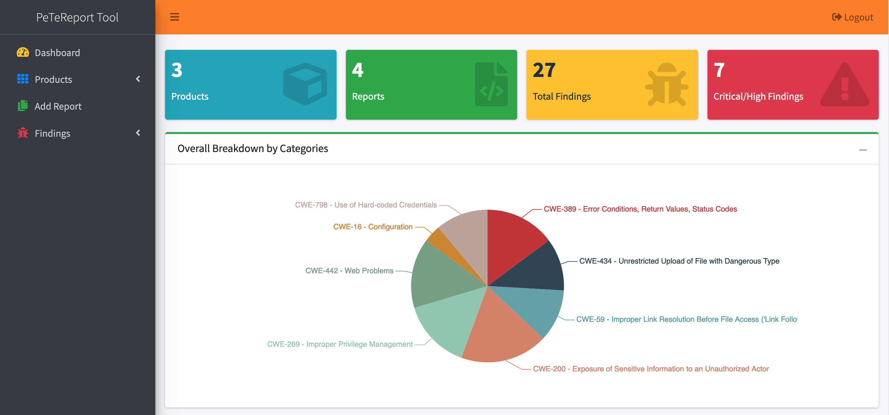
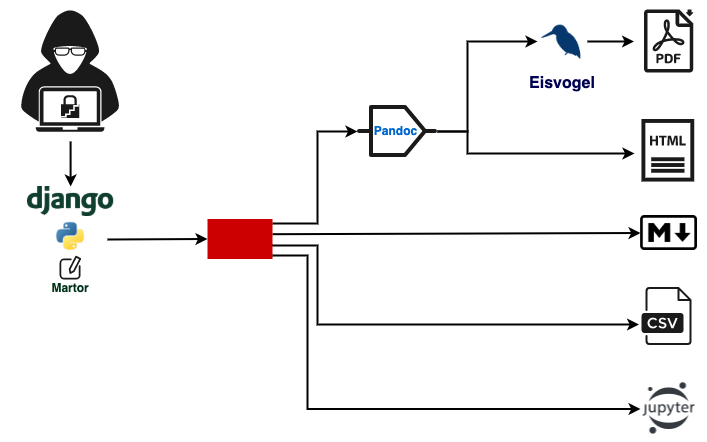
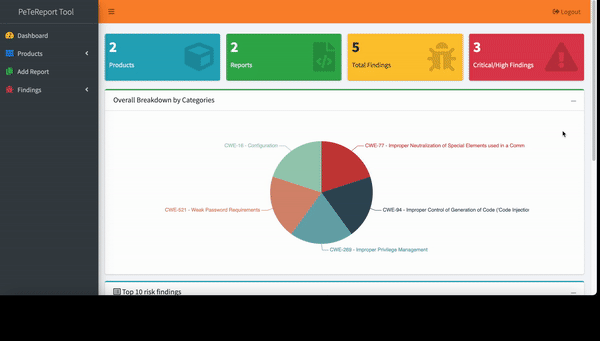

# PeTeReport 

<h4 align="center">A simple, fast, Pentesting content management and reporting tool</h4>

<h1 align="center">
   
  
   
</h1>

PeTeReport (**Pe**n**Te**st **Report**), Pentest Reporting Tool written in Django and Python 3 with the aim to help pentesters to manage a finding repository, write reports (in Markdown) and generate reports in different formats (HTML, CSV, PDF and Markdown).

Focused in product security the tool help security researchers and pentesters to write reports, and manage a finding template database to avoid wasting time spent in the reporting phase.

## Architecture

## Installation and deployment

- [x] [Docker](doc/docker.md)
- [x] [Django](doc/django.md)

## Features

| Feature | PeTeReport |
|-----------------------------------------------------|---|
| Customizable reports output                         | ✔ |
| Customizable reports templates                      | ✔ |
| Findings template database                          | ✔ |
| Possibility to add Appendix to findings             | ✔ |
| HTML Output format                                  | ✔ |
| CSV Output format                                   | ✔ |
| PDF Output format                                   | ✔ |
| Markdown Output format                              | ✔ |
| Jupyter Output format                               |   |
| CVSS 3.1 Score                                      | ✔ |
| Docker installation                                 | ✔ |
| DefectDojo integration                              |   |
| User management                                     | ✔ |

## Demo

## Sample Reports

[PDF Sample](sample_reports/PEN-PDF_Offensive_Security_Network_202108181118.pdf "PDF Sample")

[HTML Sample](sample_reports/PEN-HTML_Offensive_Security_Network_202108181117.html "HTML Sample")

[MD Sample](sample_reports/PEN-MD_Offensive_Security_Network_202108181118.md "MD Sample")

[CSV Sample](sample_reports/PEN-CSV_Offensive_Security_Network_202108181118.csv "CSV Sample")

